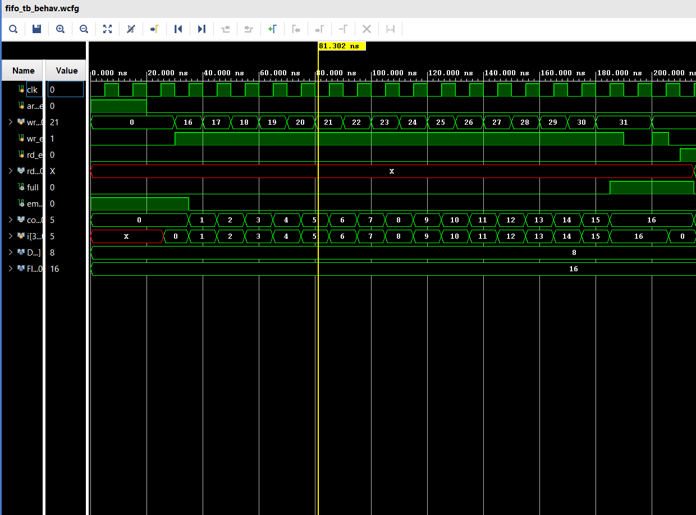
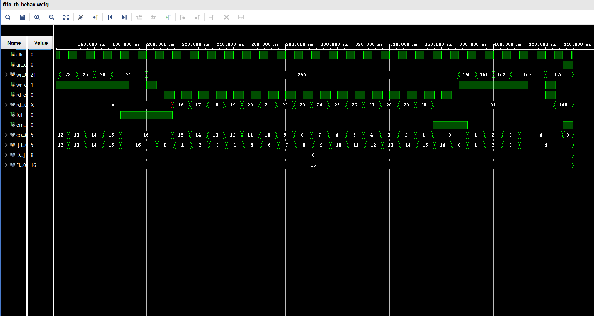

# FIFO Design & Verification

A synchronous FIFO (First-In-First-Out) buffer, parameterized by data width and depth, with a basic Verilog testbench.

## Design

`fifo_design.v` implements a circular-buffer FIFO using:
- Separate write and read pointers, each one bit wider than needed to address the memory, to distinguish the full condition from the empty condition without extra flags.
- A registered `count` output tracking current occupancy.
- Asynchronous, active-high reset (`areset`).
- Full and empty detection derived combinationally from the pointers.

### Ports

| Port     | Direction | Width                 | Description                      |
|----------|-----------|-----------------------|-----------------------------------|
| clk      | input     | 1                     | Clock                            |
| areset   | input     | 1                     | Asynchronous, active-high reset  |
| wr_data  | input     | DATA_WIDTH            | Write data                       |
| wr_en    | input     | 1                     | Write enable                     |
| rd_en    | input     | 1                     | Read enable                      |
| rd_data  | output    | DATA_WIDTH            | Read data (registered)           |
| full     | output    | 1                     | FIFO full flag                   |
| empty    | output    | 1                     | FIFO empty flag                  |
| count    | output    | $clog2(FIFO_DEPTH)+1  | Current number of items stored   |

### Parameters
- `DATA_WIDTH` (default 8)
- `FIFO_DEPTH` (default 16)

## Testbench

`fifo_tb.sv` is a basic testbench that drives inputs on the negative clock edge and lets the DUT sample them on the following positive edge, avoiding race conditions between testbench stimulus and DUT sampling.

Covered scenarios:
1. Reset - verifies empty=1, full=0, count=0 after areset.
2. Fill to full - writes FIFO_DEPTH items, checks full asserts at the correct point, and confirms a write attempted while full is correctly blocked.
3. Drain to empty - reads all items back out, verifies FIFO ordering (first written = first read), checks empty asserts correctly, and confirms a read attempted while empty is correctly blocked.
4. Simultaneous read and write - with the FIFO neither full nor empty, asserts wr_en and rd_en on the same clock edge and verifies count stays unchanged.
5. Asynchronous reset mid-operation - asserts areset while the FIFO holds data and verifies it clears immediately and correctly.

Each check prints PASS or FAIL with the relevant signal values to the simulation console.

## Running the simulation

